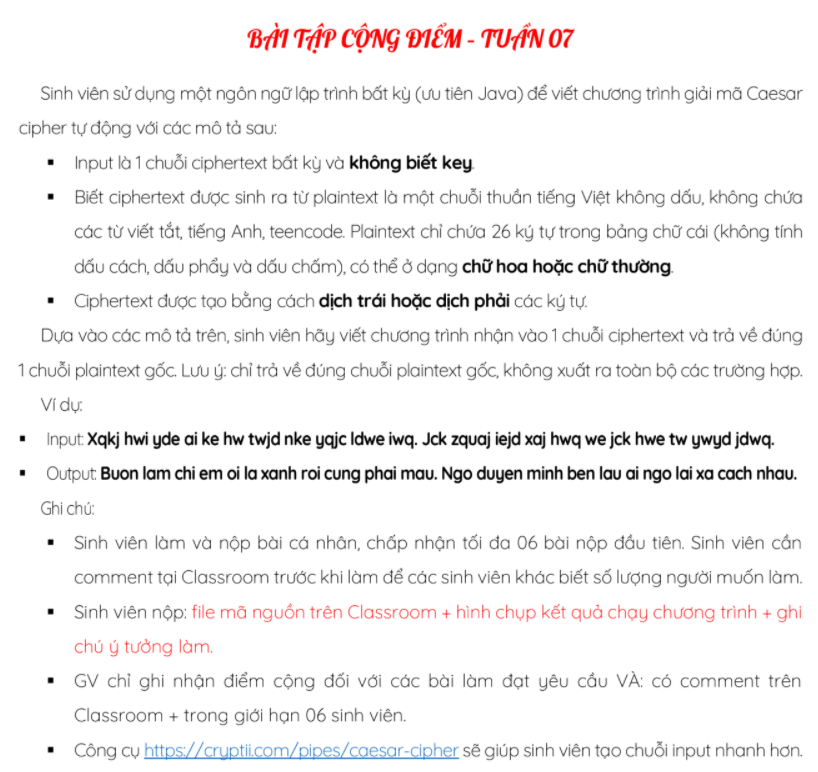

# Decrypt vietnamese caesar cipher

Một tool nhỏ giúp giải mã chuỗi tiếng việt (không dấu) đã bị mã hóa bằng phương pháp CaesarCipher.

## Đề bài

## Ý tưởng:
- B1: Tạo ra **26 bản decrypt** từ ciphertext đầu vào.
- B2: Tìm những **tổ hợp** phụ âm, nguyên âm, ... của tiếng việt trong từng bản decrypt **(dựa vào [Đây](https://mltav.asn.au/vietnamese/images/documents/Van/wa-van.pdf))**.
- B3: **Tính điểm** (dựa trên độ dài của tổ hợp tìm được) cho từng bản decrypt.
- B4: Chọn bản decrypt có số **điểm cao nhất**.

## Demo

[Link Demo](https://hoangtran0410.github.io/decrypt-vietnamese-caesar-cipher)
